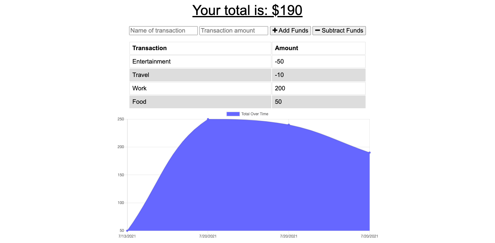

# Budget Tracker


## Description

This application allows users to add expenses and deposits to their budget.

- MongoDB
- Mongoose
- Heroku

## Table of Contents

- [Installation](#installation)
- [Usage](#usage)
- [Deployed Application](#deplyedApplication)
- [Resources](#resources)
- [Questions](#questions)

## Installation

```
npm install
```

## Usage

```
npm start
```

## Deployed Application

The deployed application can be viewed here: [Budget Tracker](https://mighty-headland-47120.herokuapp.com/)

When the user is first directed to the Workout Tracker they will see this image. Users can either create a new workout or continue their workout should they have one existing.  


## Resources

[Manifest](https://developer.mozilla.org/en-US/docs/Web/Manifest)

[IndexedDB](https://developer.mozilla.org/en-US/docs/Web/API/IndexedDB_API/Using_IndexedDB)

## Questions

If you have any questions or would like to report and issue please contact me at my [GitHub](https://github.com/harmane4) or elise_harman@hotmail.com
